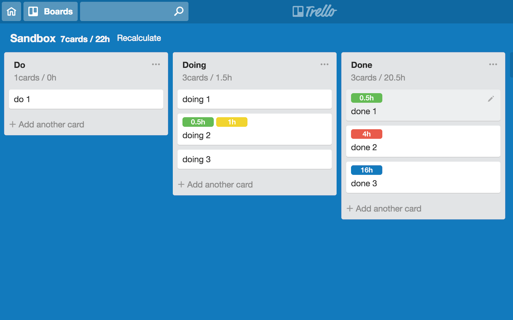

# LabelCounter for Trello
This is Chrome Extension of counts the card label titles on Trello.

# Summary
It will use the card labels for time. ex.) 1h, 2h, 4h, 8h

This Extension counts times and cards, display it.

# Required environment
* [Trello.com](https://trello.com/)
* Google Chrome
* Chrome Extension: [Card Color Titles for Trello](https://chrome.google.com/webstore/detail/card-color-titles-for-tre/hpmobkglehhleflhaefmfajhbdnjmgim)
  * for display of label text.
* Setting name of labels: 0.5h, 1h, 2h, 4h, 8h

## Links
* [Qiita::Trelloでカンバン管理のススメ](http://qiita.com/punchdrunker/items/32780f147a8fe03802f6) * in Japanese

